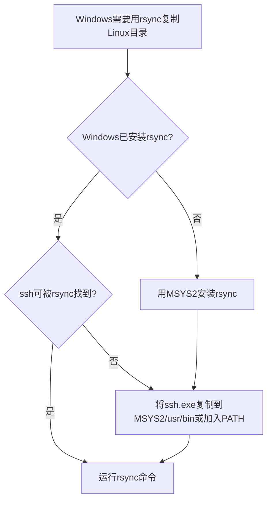

​#date/2025-05-06#​ #lastmod/2025-05-06#

## 🎯 **场景背景**

- 需求：将 Linux 主机 `/mnt/data/portrait_image`​ 目录下的大量文件复制到 Windows 主机的 `E:\Image\portrait_image` 目录。
- 环境：

  - Windows 使用 **Git Bash / MSYS2 终端**
  - 已配置 **SSH 密钥认证** 可从 Windows 通过 `ssh -i ~/.ssh/ruby root@home.yaoye.me` 连接到 Linux
  - 目标通过 **​`rsync`​** 实现增量、高效传输

---

## 🛠️ **步骤一：Windows 安装** **​`rsync`​**

1. 安装 **MSYS2** （推荐，因为 Git for Windows 自带 `rsync` 可能依赖不足）

   - 下载地址：[https://www.msys2.org/](https://www.msys2.org/)
2. 在 MSYS2 终端运行：

   ```bash
   pacman -Sy
   pacman -S rsync
   ```

   ✅ 确认安装完成：

   ```bash
   rsync --version
   ```

---

## 🛠️ **步骤二：确保** **​`ssh.exe`​**​ **可被** **​`rsync`​**​ **调用**

⚠️ Windows 下 `rsync`​ 不会自动找到 `ssh.exe`，需要手动处理：

✅ **方法一（推荐）** ：将 Git for Windows 的 `ssh.exe`​ 复制到 MSYS2 安装目录（`/usr/bin/`​ 或 `msys64/usr/bin`）

- Git for Windows 的 `ssh.exe` 路径通常是：

  ```
  C:\Program Files\Git\usr\bin\ssh.exe
  ```
- 复制到：

  ```
  C:\msys64\usr\bin\ssh.exe
  ```

✅ **方法二（可选）** ：将 `ssh.exe` 所在目录加入 Windows 的 PATH 环境变量

---

## 🛠️ **步骤三：在 Windows 中执行** **​`rsync`​**​ **命令**

命令结构：

```bash
rsync -avz --info=progress2 -e "ssh -i ~/.ssh/ruby" root@home.yaoye.me:/mnt/data/portrait_image/ /e/Image/portrait_image/
```

含义解析：

- ​`-a` → 归档模式，保留权限、时间戳、符号链接等
- ​`-v` → verbose，显示详细信息
- ​`-z` → 传输时压缩
- ​`--info=progress2` → 显示整体进度
- ​`-e "ssh -i ~/.ssh/ruby"` → 指定 SSH 命令及私钥
- ​`root@home.yaoye.me:/mnt/data/portrait_image/` → 源路径
- ​`/e/Image/portrait_image/` → 目标路径（Git Bash/MSYS2 里的路径写法）

✅ **运行后：**

- Windows 本地 `/e/Image/portrait_image/`​ 目录中会完整复制 Linux 上的 `/mnt/data/portrait_image/` 内容

---

## 📝 **遇到问题及解决方案记录**

### 1️⃣ `rsync: command not found`

→ 解决：

- 安装 `rsync`：

  ```bash
  pacman -Sy
  pacman -S rsync
  ```

---

### 2️⃣ `rsync: [Receiver] Failed to exec ssh: No such file or directory`

→ 原因：

- ​`rsync`​ 调用不到 `ssh.exe`

→ 解决：  
✅ 将 `ssh.exe`​ 复制到 `rsync`​ 所在目录（MSYS2 `/usr/bin`​）  
✅ 或将 `ssh.exe`​ 所在目录（如 `C:\Program Files\Git\usr\bin`）添加到 Windows 环境变量 PATH

---

## 📝 **附加命令示例**

### ✅ **只同步最新文件（跳过未修改）**

```bash
rsync -avzu --info=progress2 -e "ssh -i ~/.ssh/ruby" root@home.yaoye.me:/mnt/data/portrait_image/ /e/Image/portrait_image/
```

- ​`-u` → 只覆盖目标比源旧的文件

---

### ✅ **排除部分文件类型**

```bash
rsync -avz --exclude='*.tmp' --info=progress2 -e "ssh -i ~/.ssh/ruby" root@home.yaoye.me:/mnt/data/portrait_image/ /e/Image/portrait_image/
```

---

### ✅ **仅复制文件，不要目录结构**

```bash
rsync -avz --no-relative --info=progress2 -e "ssh -i ~/.ssh/ruby" root@home.yaoye.me:/mnt/data/portrait_image/ /e/Image/portrait_image/
```

---

## 🔍 **经验总结**

✅ Windows 下 `rsync`​ 运行关键 → 确保 **ssh.exe 路径可被** **​`rsync`​**​ **调用**  
✅ 推荐用 **MSYS2 提供的环境 + Git for Windows 的 ssh**  
✅ 传输大量文件时建议 `--info=progress2`​ 查看整体进度  
✅ 使用 `-z` 压缩可提升网络传输效率（但占 CPU）

---

## 📐 **流程图总结**



---

## 🏁 **最终笔记特点**

✅ 兼顾 Windows 与 Linux 环境差异  
✅ 涵盖安装、配置、命令、问题排查  
✅ 记录原因 → 解决过程 → 成功操作  
✅ 未来可直接作为标准操作流程

---

## **继续深入探讨的问题：**

**Q1**  
如何配置 `rsync` 自动定时同步 Windows 和 Linux 文件，确保双向更新？

**Q2**  
在 Windows 下如何用 `rsync` 保留 Linux 文件的符号链接和权限？

**Q3**  
如果网络不稳定导致 `rsync`​ 中断，如何使用 `rsync --partial` 实现断点续传？
